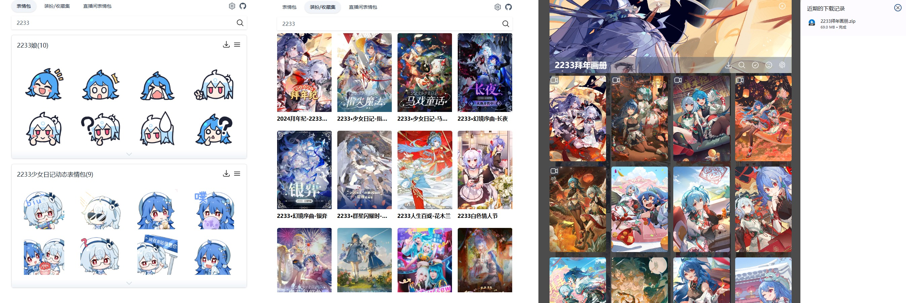
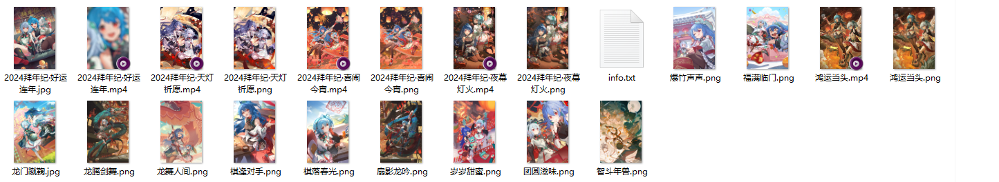

在线批量下载 B 站评论区表情包、直播间表情包和收藏集，提供网页版和移动端页面

[在线访问](https://bili-emoji-downloader-vue.vercel.app/)
[自行部署](https://vercel.com/new/git/external?repository-url=https://github.com/magicFeirl/bili-emoji-downloader-vue)

## 页面效果

表情包搜索/收藏集搜索 & 下载




## 开发

根据项目 `api/example.env` 中的示例环境变量字段配置环境变量，之后在 vercel 中导入配置的环境变量值，重新部署项目

```sh
# vue3
npm install
npm run dev

npm run build

# python
pip install -r requirements.txt
cd api
cp example.env .env
# edit .env
uvicorn index:app
```
